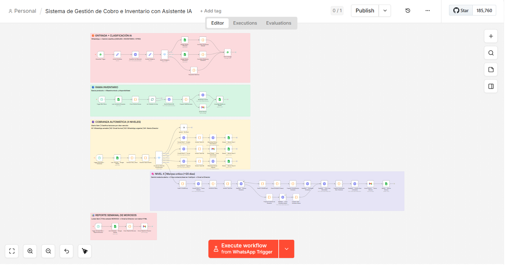
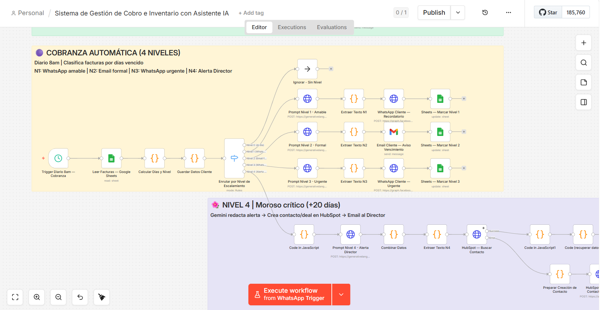

# 🤖 AI-Powered Inventory & Collections Management System

> End-to-end business automation built with N8N, Gemini AI, WhatsApp Business API, Google Sheets, Gmail and HubSpot CRM. Automates inventory alerts, purchase orders, collections escalation and CRM tracking — without a single manual step.

[](https://n8n.io)
[](https://ai.google.dev)
[](https://developers.facebook.com/docs/whatsapp)
[](https://hubspot.com)
[](LICENSE)
[](https://github.com/alejandro-orbis)

---

## 🎯 What does it do?

Three fully automated modules running daily without human intervention:

### 🤖 WhatsApp AI Assistant
Customers send a WhatsApp message and receive instant replies:
- **Balance inquiry** → "How much do I owe?" → Returns real data from Google Sheets
- **Inventory inquiry** → "Do you have detergent?" → Returns live stock status
- **Other** → Friendly automated response with available options

### 📦 Module 1A — Inventory Alerts & Automatic Purchase Orders
Every day at 8am the system:
1. Reads the full inventory from Google Sheets
2. Detects products below minimum stock level
3. Uses **Gemini AI** to generate a purchase order draft with the last 3 purchase history
4. Sends a **WhatsApp** summary to the purchasing assistant
5. Sends an **HTML email** to the Director with Authorize / Correct buttons
6. Updates Google Sheets to `PENDING` status

### 💰 Module 1B — Preventive Collections with 4 Escalation Levels
Every day at 8am the system classifies every invoice and acts accordingly:

| Level | Trigger | Channel | Tone |
|---|---|---|---|
| 1 | 3 days before due | WhatsApp | Friendly reminder |
| 2 | Due today | Email | Formal notice |
| 3 | 8 days overdue | WhatsApp | Urgent follow-up |
| 4 | 20+ days overdue | Email to Director + HubSpot | Critical alert |

For each critical debtor (Level 4):
- Creates or updates the **contact in HubSpot**
- Creates a **Deal** linked to the invoice
- Associates the Deal to the contact automatically
- Sends alert email to the Director with AI-generated message
- Updates status in Google Sheets

### 📊 Weekly Report — Every Monday at 8am
Automatically generates and emails the Director a full report of all delinquent clients with total outstanding debt.

---

## 🛠️ Tech Stack

| Tool | Purpose |
|---|---|
| [N8N](https://n8n.io) | Workflow orchestration and automation |
| [Gemini AI](https://ai.google.dev) | Message generation and intent classification |
| [WhatsApp Business API](https://developers.facebook.com/docs/whatsapp) | Inbound and outbound messaging |
| [Google Sheets](https://sheets.google.com) | Intermediate data layer (simulates ERP) |
| [Gmail](https://gmail.com) | Email notifications and reports |
| [HubSpot CRM](https://hubspot.com) | Contact management and deal tracking |

---

## 📁 Project Structure

```
├── debt-collection-inventory-ai.json
│                          ← N8N workflow (import directly)
├── data/
│   └── Proyecto_Inventario_Cobranza.xlsx
│                          ← Google Sheets template (upload to Drive)
└── README.md
```

## 📸 Screenshots

| Workflow Overview | Collections Flow | Inventory Alert |
|---|---|---|
|  |  |  |

---

## 🚀 Setup Guide

### 1. Prerequisites

- N8N instance (cloud or self-hosted)
- Google account (Sheets + Gmail)
- Meta for Developers account + WhatsApp Business API
- Google AI Studio account (Gemini API key)
- HubSpot account (free tier works)

### 2. Configure credentials in N8N

| Credential | Where to get it |
|---|---|
| Gemini API Key | [aistudio.google.com](https://aistudio.google.com) |
| WhatsApp Access Token | Meta for Developers → Your App → WhatsApp → API Setup |
| WhatsApp Phone Number ID | Same location as above |
| Google Sheets OAuth | N8N built-in Google OAuth |
| Gmail OAuth | N8N built-in Google OAuth |
| HubSpot Private App Token | HubSpot → Settings → Integrations → Private Apps |

### 3. Upload the Google Sheets template

Upload `Proyecto_Inventario_Cobranza.xlsx` to Google Drive and copy the Sheet ID from the URL:
```
https://docs.google.com/spreadsheets/d/YOUR_SHEET_ID/edit
```

### 4. Import the N8N workflow

In N8N: `...` menu → **Import from file** → select the JSON file.

### 5. Update the Sheet ID

Search for `TU_SHEET_ID_AQUI` in the imported workflow and replace with your real Sheet ID.

### 6. Configure the WhatsApp Webhook

In Meta for Developers → WhatsApp → Configuration → Webhook:
```
Callback URL: https://your-n8n-instance.com/webhook/webhook
Verify token: your-custom-token
```

### 7. Activate the workflow

Toggle the workflow to **Active** in N8N.

---

## 📋 Google Sheets Structure

### Inventory sheet

| Column | Description |
|---|---|
| `producto` | Product name |
| `stock_actual` | Current stock |
| `stock_minimo` | Minimum stock level |
| `proveedor` | Supplier name |
| `email_proveedor` | Supplier email |
| `whatsapp_proveedor` | Supplier WhatsApp (with country code) |
| `precio_unitario` | Unit price |
| `ultima_compra_1/2/3` | Last 3 purchase dates |
| `cantidad_1/2/3` | Quantities of last 3 purchases |
| `precio_1/2/3` | Prices of last 3 purchases |
| `alerta_activa` | SÍ / NO / PENDIENTE |

### Collections sheet

| Column | Description |
|---|---|
| `cliente` | Company name |
| `contacto` | Contact person |
| `email` | Contact email |
| `whatsapp` | WhatsApp number (with country code, no +) |
| `factura` | Invoice number |
| `importe` | Amount |
| `fecha_vencimiento` | Due date (YYYY-MM-DD) |
| `nivel_escalamiento` | Current level (0-4) |
| `ultimo_contacto` | Last contact date |
| `estado` | AL DÍA / POR VENCER / VENCE HOY / VENCIDA / MOROSO |

---

## 🔄 Workflow Architecture

```
WhatsApp Trigger
  → Gemini classifies intent (ADEUDO / INVENTARIO / OTRO)
  → Google Sheets query
  → Formatted response → WhatsApp reply

Schedule Trigger (daily 8am) — Inventory
  → Read Google Sheets
  → Filter low stock (alerta_activa = SÍ)
  → Split by product
  → Gemini generates PO draft
  → WhatsApp to assistant + Email to Director
  → Update Sheets to PENDING

Schedule Trigger (daily 8am) — Collections
  → Read Google Sheets
  → Calculate days overdue → assign level
  → Route by level (Switch)
  → Gemini generates personalized message
  → Send via WhatsApp / Email
  → Level 4: HubSpot contact + Deal + Association
  → Update Sheets

Schedule Trigger (Monday 8am) — Weekly Report
  → Read all delinquent clients
  → Generate HTML report
  → Email to Director
```

---

## 📄 License

MIT License — free for personal and commercial use.

---

## 👤 Author

**Alejandro Peralta** — Process Automation Specialist

- GitHub: [@alejandro-orbis](https://github.com/alejandro-orbis)
- LinkedIn: [linkedin.com/in/alejandro-orbis](https://linkedin.com/in/alejandro-orbis)
- Email: [alejandro@orbisautomations.com](mailto:alejandro@orbisautomations.com)

---

*Built to eliminate repetitive operational work — so teams focus on what actually matters.*
